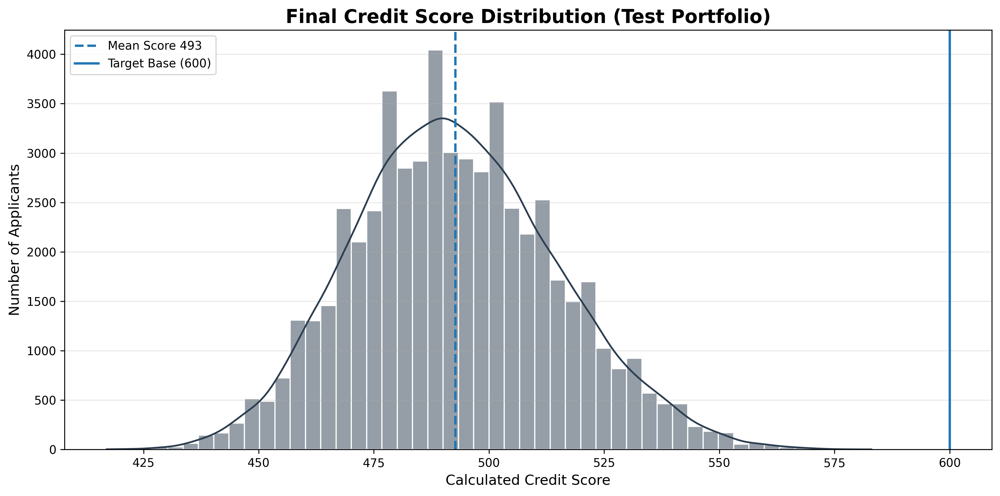
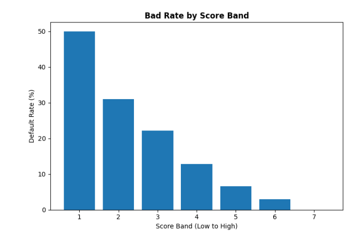
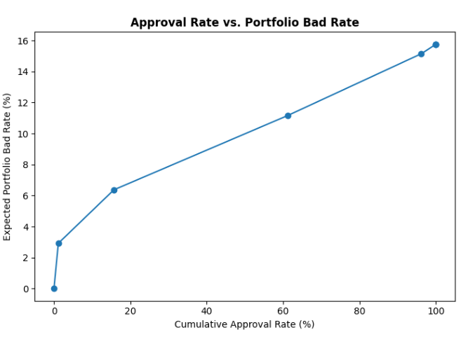

# credit_risk_scorecard
Credit Risk Scorecard built using Python and Logistic Regression.
# Consumer Credit Risk Scorecard Pipeline

An end-to-end **Probability of Default (PD)** scorecard built using **2.26 million LendingClub loan records** following traditional retail banking methodology.

---

## Executive Summary

This project delivers an end-to-end credit risk scorecard pipeline built on **2.26 million historical loan records** from LendingClub. The objective was to build an interpretable, institutionally rigorous **Probability of Default (PD)** model following the same methodology used by retail banks and NBFCs — **Weight of Evidence (WoE) transformation, logistic regression scoring, and strict Out-of-Time (OOT) validation.**

The pipeline is built entirely **without high-level AutoML or scorecard libraries**. The WoE/IV engine, imputation logic, and scorecard scaling were implemented from scratch, making every modelling decision explicit, transparent, and auditable.

---

## Project Highlights

- **Dataset:** LendingClub Loan Dataset
- **Initial Records:** 2.26 Million
- **Final Development Dataset:** 1.34 Million
- **Model:** Logistic Regression Scorecard
- **Validation Strategy:** Chronological Out-of-Time Validation
- **Score Scaling:** PDO = 20
- **Score Range:** 365–621
- **Final Features:** 29 WoE-transformed variables

---

# Key Technical Achievements

## Memory and Infrastructure Engineering

Processed **2.26 million** raw loan records on standard consumer hardware using:

- Numeric downcasting
- Category-type conversion
- Explicit garbage collection (`gc.collect()`)
- Memory-aware preprocessing

The final development dataset retained **1.34 million** clean observations without exceeding memory limitations.

---

## Custom WoE / IV Engine

Developed a **pure Python Weight of Evidence (WoE)** and **Information Value (IV)** engine from scratch featuring:

- Automatic WoE calculation
- Information Value calculation
- Laplace smoothing for zero-frequency bins
- Automatic variable screening

The feature selection process reduced **150 raw variables** to **29 predictive, non-leaky features** using an **IV ≥ 0.02** threshold.

Variables with **IV > 0.50** (primarily settlement and recovery variables) were correctly identified as **post-default leakage** and removed from model development.

---

## Strict Out-of-Time Validation

Rather than performing a random train-test split, the dataset was divided chronologically.

- **Training Dataset:** Loans issued between **2007–2017**
- **Testing Dataset:** Loans issued during **2018**

This validation strategy closely replicates production deployment, where a model trained on historical applicants scores future applicants while avoiding temporal leakage.

---

## Scorecard Scaling

Logistic regression log-odds were converted into an integer scorecard using the industry-standard **Points to Double Odds (PDO)** methodology.

- **PDO:** 20
- **Target Score:** 600
- **Target Odds:** 50:1 (Good : Bad)

---

# Methodology

## Target Definition

Ambiguous loan statuses (**Current**, **Late**, **In Grace Period**) were excluded.

Binary target definition:

- **Good (0):** Fully Paid
- **Bad (1):** Charged Off / Default

Portfolio default rate:

**19.98%**

---

## Leakage Audit

A systematic leakage audit was performed before modelling.

The following post-origination variables were excluded:

- Recovery amounts
- Payment history
- Hardship programme variables
- Settlement-related variables

Additionally, LendingClub's own internal credit ratings (`grade` and `sub_grade`) were removed to prevent the scorecard from simply replicating LendingClub's proprietary underwriting model.

---

## Imputation and Standardisation

Missing values were imputed using **training-set medians only**, preventing information leakage into the test dataset.

High-cardinality categorical variables (for example, **emp_title** containing over **39,000 unique categories**) were consolidated into the **100 most frequent categories**.

---

## WoE Transformation and Feature Selection

A custom Weight of Evidence transformation engine was applied to every predictor.

Feature selection retained variables with:

**Information Value (IV) ≥ 0.02**

The final scorecard contains **29 predictive variables**.

### WoE Monotonicity Audit

A monotonicity audit was performed on all selected variables.

- **21 variables** exhibited clear monotonic WoE behaviour.
- **8 variables** displayed genuine non-linear risk relationships and were retained with documented business justification.

---

# Model Performance

Evaluation was performed on the unseen **2018 Out-of-Time test dataset**.

The underlying portfolio default rate shifted from **20.16%** in the training period to **15.76%** during the test period.

| Metric | Value |
|--------|------:|
| ROC-AUC | **65.08%** |
| Gini Coefficient | **30.16%** |
| KS Statistic | **21.92** |

The **KS Statistic of 21.92** confirms that the model achieves meaningful separation between good and bad borrowers on unseen future data.

For a logistic regression scorecard built exclusively from origination-time variables (without bureau refresh or behavioural variables), this represents an honest, non-leaky baseline consistent with thin-feature retail credit models.

---

# Score Distribution



---

# Business Output: Score Band Analysis

The scored test portfolio (**Average Score: 493**, **Range: 365–621**) was segmented into score bands to translate model output into actionable credit policy.


---

# Default Rate by Score Band



---

# Approval Rate vs Portfolio Bad Rate



---

## Business Interpretation

The score band analysis demonstrates how the scorecard can support lending decisions.

| Score Cutoff | Approval Rate | Expected Portfolio Bad Rate |
|--------------|--------------:|----------------------------:|
| **≥ 515** | **15.7%** | **6.37%** |
| **≥ 485** | **61.2%** | **11.16%** |

A cutoff score of **515** yields a highly selective approval strategy with a portfolio bad rate significantly below the overall portfolio average.

Reducing the cutoff to **485** substantially increases approval rates while maintaining acceptable portfolio risk, illustrating the trade-off between business growth and credit quality.

---

# Technologies Used

- Python
- Pandas
- NumPy
- Scikit-learn
- SciPy
- Matplotlib
- Jupyter Notebook

---

# Repository Structure

```text
credit_risk_scorecard/

├── Credit_Risk_Scorecard.ipynb
├── README.md
├── requirements.txt
├── score_distribution.png
├── score_band_table.png
├── default_rate_vs_score_band.png
├── approval_rate_vs_portfolio_bad_rate.png
```

---

# How to Run

1. Clone the repository.
2. Install the required dependencies:

```bash
pip install -r requirements.txt
```

3. Place the LendingClub `loan.csv` dataset in the project directory.

4. Execute the notebook sequentially from top to bottom.

> **Note:** The notebook uses explicit `gc.collect()` and `del` statements throughout for memory management. These cells should not be skipped.

---

# Disclaimer

This project was developed as a portfolio demonstration of **retail credit risk modelling** using publicly available LendingClub loan data.

The implementation follows traditional institutional credit risk methodology including **Weight of Evidence transformation, Information Value feature selection, Logistic Regression scorecards, PDO score scaling, leakage auditing, WoE monotonicity assessment, and Out-of-Time validation.**
