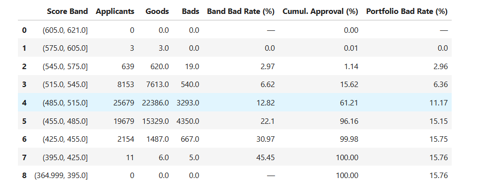

# credit_risk_scorecard
Credit Risk Scorecard built using Python and Logistic Regression.
Project Overview

This project develops an end-to-end Probability of Default (PD) scorecard using over 2.26 million historical LendingClub loan records. The objective is to build an interpretable, institution-grade credit risk model following traditional retail banking methodology.
The entire pipeline was implemented from scratch in Python, including a custom Weight of Evidence (WoE) transformation engine, Information Value (IV) selection, score scaling, and out-of-time validation, making every modelling decision explicit and auditable.

Business Objective

Develop a credit scorecard that estimates the probability of default for loan applicants and translates model predictions into an interpretable, points-based scoring system that supports actionable credit approval decisions.

Dataset

Source: LendingClub Loan Dataset

Initial Records: 2.26 million

Development Dataset: 1.34 million clean, definitive-status loans

Training Period: 2007–2017 (1.29M records)

Out-of-Time Test Period: 2018 (56K records)

Methodology & Key Technical Achievements

Memory and Infrastructure Engineering: Processed 2.26M raw records on standard consumer hardware using numeric downcasting, category-type conversion, and explicit garbage collection.

Custom WoE / IV Engine: Built a pure-Python Weight of Evidence and Information Value engine with Laplace smoothing for zero-division edge cases. Screened 150 raw columns down to 29 predictive, non-leaky features.

WoE Monotonicity Audit: Conducted a strict monotonicity audit. 21 features showed clean directional WoE trends.

Strict Out-of-Time (OOT) Validation: The dataset was split chronologically rather than randomly. This simulates actual deployment conditions where a model trained on historical data scores future applicants, proving resilience against macroeconomic drift.

Scorecard Scaling: Logistic regression log-odds were converted into an integer points system using the PDO (Points to Double Odds) methodology with PDO = 20, target score = 600 at 50:1 good-to-bad odds.

Model Performance (OOT Test Set)

Evaluated on the unseen 2018 OOT test set. The underlying default rate shifted significantly from 20.16% in training to 15.76% in the test period.

Metric                                  Value

ROC-AUC                                 65.08%

Gini Coefficient                        30.16%

KS Statistic                            21.92

Validation Insight: The KS of 21.92 confirms the model achieves meaningful, stable separation between good and bad borrowers on unseen future data. For a scorecard using only origination-time features (no bureau refresh or behavioural data), this represents an honest, non-leaky baseline consistent with thin-feature retail credit models.

Business Results: Score Band Analysis

The scored test portfolio (Average Score: 493, Range: 365–621) was segmented into score bands to translate model output into actionable credit policy:

Score Band

Applicants

Bad Rate

Cumul. Approval

Portfolio Bad Rate

545–621

650

2.92%

1.20%

2.92%

515–545

8,193

6.64%

15.70%

6.37%

485–515

25,625

12.81%

61.20%

11.16%

455–485

19,670

22.12%

96.10%

15.14%

Below 455

2,180

31–50%

100.00%

15.76%

[Insert images/score_bands.png Here]

Strategy: A cutoff at score 515 yields a 15.7% approval rate with a 6.37% expected portfolio bad rate — well below the portfolio average. A cutoff at score 485 approves 61.2% of applicants at an 11.16% bad rate.

Technologies Used

Python (Pandas, NumPy, SciPy)

Scikit-learn (Logistic Regression, Validation Metrics)

Matplotlib & Seaborn (Data Visualization)

Jupyter Notebook

Repository Structure

├── 01_problem_and_target_2.ipynb   # Main Pipeline & Analysis
├── README.md                       # Project Documentation
├── requirements.txt                # Dependencies
├── images/                         # Saved visual outputs
└── data/                           # Place loan.csv here

How to Run

Clone the repository and install dependencies from requirements.txt.

Place the LendingClub loan.csv file in the /data directory.

Execute the notebook sequentially, do not skip cells.

Note: The pipeline uses explicit gc.collect() and del blocks throughout. These are required for memory management on standard hardware and must not be skipped.

Disclaimer: This project was developed as a portfolio demonstration of applied quantitative finance and retail credit risk modelling using publicly available LendingClub data. It is intended for educational and research purposes only.
